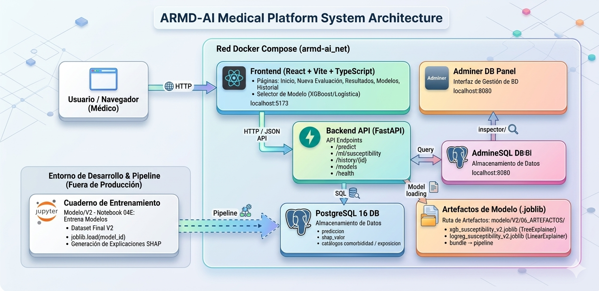
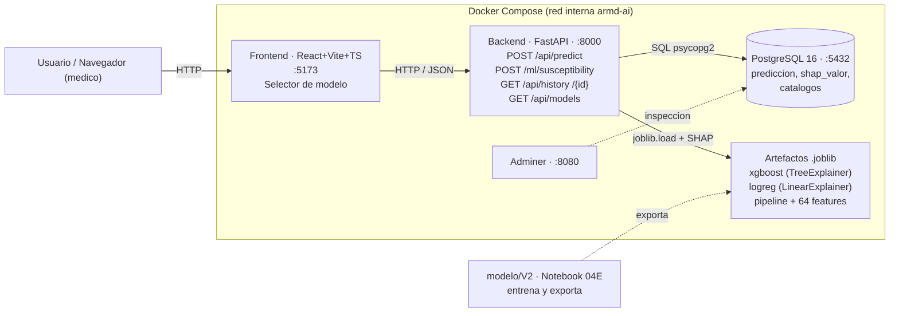

# Arquitectura y comunicaciones — ARMD-AI

Diagrama del flujo completo del sistema (todo orquestado con **Docker Compose**).

- Archivo editable: **`DIAGRAMA_ARQUITECTURA_ARMD_AI.drawio`** (abrir en draw.io / diagrams.net).
- Imagen exportada: ver abajo. Vista rápida adicional: diagrama Mermaid al final.

## Cómo se comunica todo

1. El **navegador** del usuario abre el **Frontend** (React + Vite + TypeScript) en `http://localhost:5173`.
2. El **Frontend** llama por **HTTP/JSON** a los endpoints del **Backend** (FastAPI) en `http://localhost:8000`:
   `POST /api/predict`, `POST /ml/susceptibility`, `GET /api/history` y `/api/history/{id}`, `GET /api/models`.
3. El **Backend** carga el modelo elegido (`model_id`) haciendo `joblib.load` del **artefacto `.joblib`**
   correspondiente, ejecuta `predict_proba` y calcula **SHAP** (TreeExplainer para XGBoost, LinearExplainer para
   la Regresión Logística).
4. El **Backend** guarda/consulta el **historial** en **PostgreSQL** vía `psycopg2`
   (tablas `prediccion`, `shap_valor` y catálogos).
5. Los **artefactos `.joblib`** los produce el **notebook `04E`** (entrena XGBoost y Regresión Logística sobre el
   dataset final V2 y los exporta a `modelo/V2/06_ARTEFACTOS/`).
6. **Adminer** (`http://localhost:8080`) permite inspeccionar la base de datos.

## Diagrama (Mermaid)

## Notas
- El **navegador** corre en el host: por eso el frontend usa `http://localhost:8000` (puerto publicado), no el
  nombre interno del servicio.
- Dentro de la red de Compose, el backend se conecta a la base por el nombre de servicio `postgres` (no `localhost`).
- Reentrenar = re-ejecutar `04E` y luego `docker compose restart backend` para que recargue los `.joblib`.
