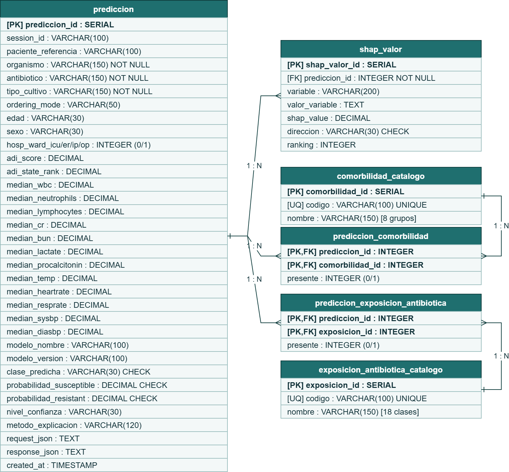
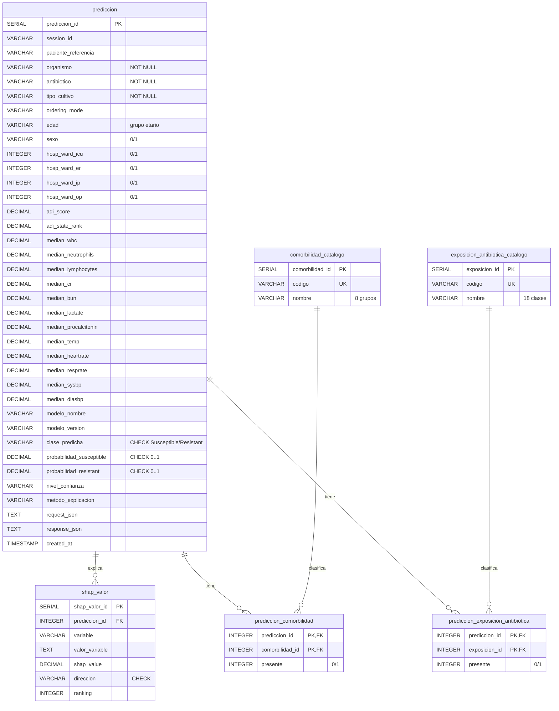

# Diagrama de base de datos — ARMD-AI (PostgreSQL)

Modelo entidad–relación del historial de predicciones de susceptibilidad antibiótica
(XGBoost + SHAP). Motor: **PostgreSQL** (esquema en `base_datos_prediccion.sql`).

- Archivo editable: **`DIAGRAMA_BD_ARMD_AI.drawio`** (abrir en <https://app.diagrams.net> / draw.io).
- Imagen exportada: ver abajo. Vista rápida adicional: diagrama Mermaid al final (se renderiza en GitHub y VS Code).

## Relaciones

- `prediccion` **1 — N** `shap_valor` (variables SHAP por predicción).
- `prediccion` **1 — N** `prediccion_comorbilidad` **N — 1** `comorbilidad_catalogo` (relación muchos-a-muchos).
- `prediccion` **1 — N** `prediccion_exposicion_antibiotica` **N — 1** `exposicion_antibiotica_catalogo` (muchos-a-muchos).

Todas las llaves foráneas hacia `prediccion` usan `ON UPDATE CASCADE ON DELETE CASCADE`.

## Diagrama ER (Mermaid)

## Notas de diseño

- `prediccion` es la tabla central: guarda entrada del caso, probabilidades, clase predicha, versión del
  modelo y los JSON crudos de request/response (`TEXT`).
- `shap_valor` almacena los factores explicativos (SHAP) de cada predicción, con `direccion` y `ranking`.
- Las tablas `*_catalogo` normalizan los códigos de comorbilidad y de exposición antibiótica previa; las
  tablas puente (`prediccion_comorbilidad`, `prediccion_exposicion_antibiotica`) registran cuáles aplican
  a cada predicción (clave primaria compuesta).
